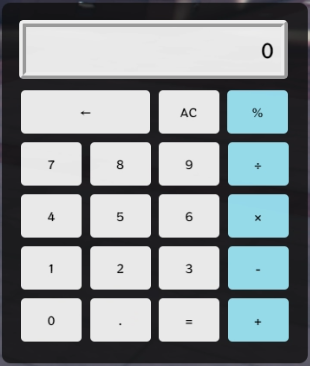

# Features
- Simple calculator system  
- Supports keyboard input

# Installation
- Download the zip file  
- Extract the downloaded zip file  
- Place `rnl-calculator` into your `resources` folder  
- Add `ensure rnl-calculator` to your `server.cfg`  
- Restart your server

# Usage
Use the `/cal` command to open the calculator UI  
 

- Press number buttons to input values  
- Press the AC button to reset input  
- Press the ← button to delete values one by one  
- Press the operator buttons on the right to calculate

# Dependencies
Confirmed working with:  
QBCore  
 
Should work with:  
All frameworks (based on code compatibility)

# 特徴
- シンプルな計算機システム
- キーボード入力に対応

# インストール
- zipファイルをダウンロード
- ダウンロードしたzipファイルを展開
- `rnl-calculator`を`resource`フォルダに導入
- `server.cfg`に`ensure rnl-calculator`を追加
- サーバーを再起動

# 使用方法
`/cal`コマンドを使用して計算機UIを表示 

- 数字ボタンを押して値を入力
- ACボタンを押して入力をリセット
- ←ボタンを押して値を1つずつ削除
- 右の記号を押して計算

# 依存
確認済み:
QBCore 
コード的に可能:
すべてのフレームワーク

# Download: [Github](https://github.com/Ram-0-0/rnl-calclator)

# Preview: [Youtube](https://youtu.be/JDmop5CBQbc)

# Suport: [Discord](https://discord.gg/JbfMKkz4Ss)

# Patreon: [Patreon](https://patreon.com/ditrn)

このスクリプトは以下の場所で配布/販売されています：

無料版：GitHub（https://github.com/Ram-0-0)

商用ライセンス等：Tebex（https://rnl-scripts.tebex.io/)

Patreonでは、任意の支援を受け付けています（支援しなくても全ての機能は利用可能です）。
また、支援者にはスクリプトの開発進捗やメモなどを日本語で共有しています（投稿は不定期です）。

Script is distributed via:

Free version: GitHub (https://github.com/Ram-0-0)

Commercial license: Tebex (https://rnl-scripts.tebex.io/)

Patreon is for optional support only.
All features are available for free; nothing is locked behind Patreon.
Supporters can view occasional development progress (in Japanese only).
